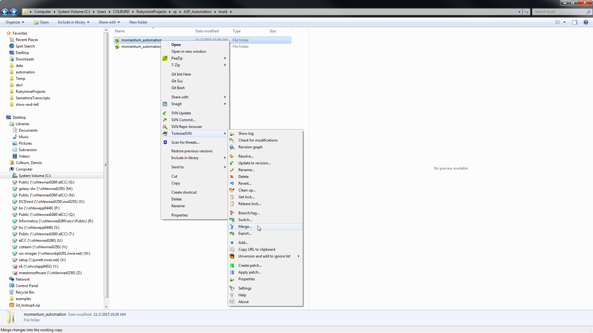

# Subversion: Best Practices for Branching and Merging

## Differences between automated tests and application development with regard to version control

### Application development
*	Trunk is production version of code
*	Release branches are changes slotted for a specific release
*	Development branches are changes not yet slotted for a release (line-level build)

### Automated Tests
*	Trunk tests production version of code
*	Release branches test a specific release
*	Development branches test changes occurring at the line level

## What does it mean to merge?
Development lines develop code in their own branch.  They are independent from other lines’ branches from a day to day standpoint.
  
It is important, however, to ensure that one team’s changes do not impact other teams.  That is where merging comes into the picture.

At a high level, merging means that a line pushes its changes from their development branch to the trunk.  Other teams then pull those changes from the trunk into their development branch.

## Merging from a branch to the trunk
On your local machine, right click on the trunk folder (i.e. the target of your merge), then navigate to TortoiseSVN...Merge.

